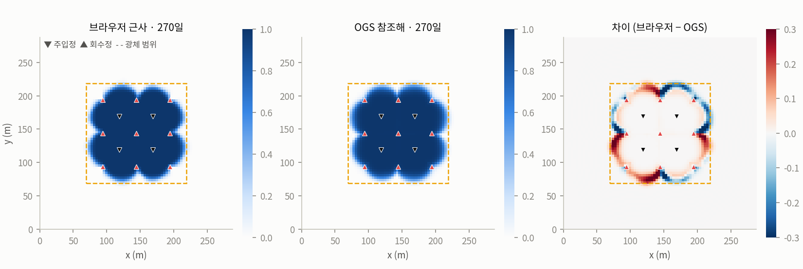
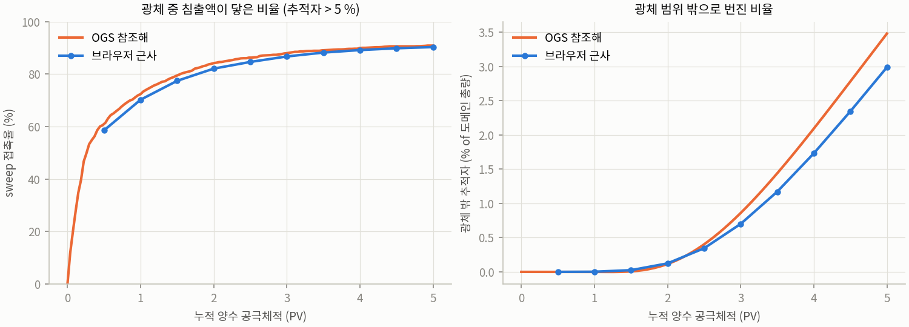
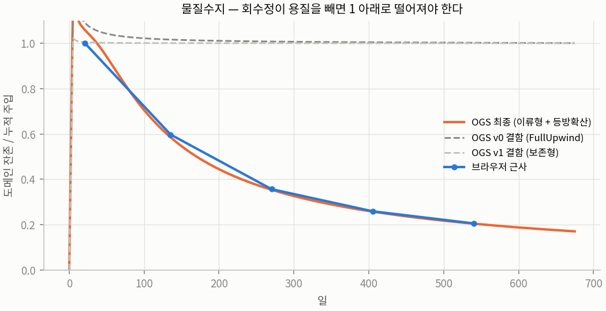

# 브라우저 근사 모델 vs OpenGeoSys 참조해 — 1단계 결과

정호 패턴식 · 포화 피압대수층 · 보존성 추적자 · 2026-09-19

## 한 줄 결론

브라우저 근사 모델(ISL Studio 패턴 탭)은 같은 시나리오의 OGS-6 참조해와 **수두에서 1 %** 이내로 일치한다. 12개 시나리오 전체에서 sweep 접촉율은 브라우저가 **평균 2 %p 낮고**(1 PV 기준 −6~+1 %p), 광체 밖 유출 분율은 봉쇄가 유지되는 조건(bleed +5 %)에서 **±1 %p**, 봉쇄가 깨진 조건(bleed −10 %)에서 브라우저가 **3~5 %p 높다**. 회수정 파과 시각은 브라우저가 0~6일 늦다. 브라우저의 유실 수치를 "상한"으로 읽어야 한다고 했던 1일차 결론은 **철회**한다. 그 결론은 결함 있는 참조해에서 나온 것이었다.

## 무엇을 비교했나

| | 브라우저 근사 | OGS 참조해 |
|---|---|---|
| 흐름 | 2D 정류 Laplace, SOR | 2D 정류 Darcy, FEM (ComponentTransport 프로세스의 압력 방정식) |
| 이송 | 명시적 풍상차분, CFL 부분스텝, 물리 분산 없음 | 음해 Backward Euler 1일, Galerkin + 등방확산 안정화(0.5), αL 2 m / αT 0.2 m |
| 정호 | 셀 소스/싱크 (셀 농도로 제거) | 절점 소스/싱크 (압력 방정식) + 주입정 농도 Dirichlet |
| 격자 | 80×80, Δx 3.6 m (160×160 도 시험) | 80×80 quad, 절점 = 브라우저 셀 중심 |
| 경계 | 고정 수두 (지역경사 0.002) | 동일 |
| 화학 | 없음 (추적자 전용으로 맞춤) | 없음 |

기본 시나리오: 5-spot, 간격 50 m, 2×2 패턴, 외곽 회수정, 정호당 주입 100 m³/d, bleed +5 %, K 1 m/d, 두께 8 m, 공극률 0.30, 5 PV(675일).

## 결과 — 기본 시나리오

| 일 | PV | 수두 RMS 차 (m) | 추적자 MAE | sweep 브라우저 / OGS | 광체 밖 브라우저 / OGS |
|---|---|---|---|---|---|
| 21 | 0.16 | 0.134 | 0.007 | 29.1 % / 34.8 % | 0.0 / 0.0 |
| 135 | 1.0 | 0.134 | 0.011 | 70.4 % / 72.4 % | 0.0 / 0.0 |
| 270 | 2.0 | 0.134 | 0.013 | 81.7 % / 84.2 % | 0.1 / 0.1 |
| 405 | 3.0 | 0.134 | 0.017 | 85.5 % / 88.0 % | 0.7 / 0.9 |
| 540 | 4.0 | 0.134 | 0.021 | 88.0 % / 90.0 % | 1.8 / 2.1 |

수두 범위 13.3 m 이므로 RMS 0.134 m 는 1.0 %. 정류이므로 시간에 따라 변하지 않는다.
sweep = 광체 사각형 내 셀 중 추적자 농도가 주입 농도의 5 %를 넘는 비율. 광체 밖 = 도메인 내 추적자 총량 중 광체 사각형 밖에 있는 비율.





**브라우저 격자를 160×160 으로 세분하면** 수두 RMS 0.133 m(변화 없음), sweep 은 1~2 %p 더 낮아지고(88.0→87.4 % @4 PV), 광체 밖은 1.8→1.5 %. 즉 브라우저의 수치분산은 참조해의 (물리+인공) 분산보다 이미 작거나 비슷하다. 격자를 더 촘촘히 해도 참조해에 가까워지지 않는다. 남는 2~3 %p 는 분산 모델의 차이(브라우저 무분산 vs OGS αL 2 m + 인공 ~0.9 m)로 설명되며, 이는 "브라우저에 물리 분산항을 넣으면 닫힌다"는 뜻이다. 2단계 후보.

## 4일차 — 참조해 자체의 결함과 수정

이번 단계에서 가장 중요한 산출물은 비교표가 아니라 이것이다.

**증상.** v0 템플릿(`FullUpwind` 안정화)으로 돌린 참조해에서 회수정 절점의 추적자 농도가 주입 농도의 40~80배로 치솟았고, 도메인 내 추적자 총량이 누적 주입량과 정확히 같았다. 회수정이 물은 빼내는데 용질은 하나도 빼지 않은 것이다. 21일 단축 검증으로는 잡히지 않았다. 파과(36일) 전이라 정상·결함이 구분되지 않기 때문이다.

**원인 분리.** 100일(파과 후)에서 이송방정식 형식 × 안정화 4조합:

| 형식 | 안정화 | 회수정 c/c_inj | 잔존/주입 | 판정 |
|---|---|---|---|---|
| 보존형 (`non_advective_form=true`) | 있음 / 없음 | 18~26 | 1.00 | 절점 싱크가 용질을 못 뺌 |
| 이류형 (기본) | `FullUpwind` | 8~12 | 1.02 | 안정화가 절점 싱크를 못 봄 — v0 |
| 이류형 (기본) | 없음 | 0.55~0.77 | 0.70 | 맞음. 단 진동 −0.13 ~ +1.09 |
| 이류형 (기본) | `IsotropicDiffusion` 0.5 | 0.32~0.45 (60일) | 무안정화와 동일 | **맞음, 진동 −0.009 — 채택** |

`FluxCorrectedTransport` 는 이 설정에서 무시되었다(무안정화와 결과 동일).



**교훈.** 참조해를 믿기 전에 물질수지부터 본다. `run_case.py` 는 이제 잔존/주입 비와 회수정 최대 농도를 `results.json` 에 넣고, 파과 후 잔존비가 0.95 를 넘거나 회수정 농도가 1.2 를 넘으면 `MASS BALANCE SUSPECT` 를 찍는다.

**채택 템플릿의 대가.** 등방확산 안정화는 인공 분산 ≈ 0.5·Δx/2 ≈ 0.9 m 를 물리 분산 αL 2 m 위에 더한다. 참조해의 전선이 실제보다 약간 더 번진다는 뜻이다. 격자를 세분하면 줄어든다(Δx 에 비례).

## 시나리오 라이브러리 (12개)

3 패턴 × 2 간격(30, 50 m) × 2 bleed(+5 %, −10 %). 각 케이스 `results.json` + `fields.bin` 이 `cases/lib/` 에 있고 스튜디오에서 바로 불러온다.

| 시나리오 | 정호 | 1 PV 일수 | sweep @1 PV (브라우저 / OGS) | sweep @5 PV (브라우저 / OGS) | 광체 밖 최대 (브라우저 / OGS) | 파과 (브라우저 / OGS) |
|---|---|---|---|---|---|---|
| 5spot_s30_bm10 | 13 | 49 | 84% / 85% | 98% / 98% | 26.6% / 22.7% | 11 d / 10 d |
| 5spot_s30_bp5 | 13 | 49 | 74% / 78% | 91% / 94% | 3.8% / 4.1% | 11 d / 10 d |
| 5spot_s50_bm10 | 13 | 135 | 80% / 81% | 97% / 97% | 26.3% / 23.4% | 35 d / 30 d |
| 5spot_s50_bp5 | 13 | 135 | 70% / 72% | 89% / 91% | 2.8% / 3.5% | 36 d / 30 d |
| 7spot_s30_bm10 | 13 | 55 | 85% / 84% | 100% / 99% | 33.4% / 30.2% | 14 d / 15 d |
| 7spot_s30_bp5 | 13 | 55 | 78% / 80% | 89% / 91% | 11.9% / 11.8% | 12 d / 15 d |
| 7spot_s50_bm10 | 13 | 153 | 83% / 83% | 99% / 99% | 33.1% / 28.3% | 46 d / 45 d |
| 7spot_s50_bp5 | 13 | 153 | 76% / 78% | 89% / 91% | 12.5% / 13.0% | 42 d / 40 d |
| line_s30_bm10 | 15 | 37 | 81% / 86% | 99% / 100% | 35.6% / 31.9% | 6 d / 5 d |
| line_s30_bp5 | 15 | 37 | 76% / 82% | 89% / 96% | 20.7% / 18.7% | 6 d / 5 d |
| line_s50_bm10 | 15 | 102 | 80% / 80% | 99% / 98% | 37.7% / 32.7% | 18 d / 15 d |
| line_s50_bp5 | 15 | 102 | 74% / 77% | 87% / 88% | 23.0% / 20.7% | 17 d / 15 d |

완료 12/12. 브라우저−OGS 평균 차: sweep@1PV -2.1%p (범위 -6.1~+0.6), sweep@5PV -1.4%p, 광체 밖 최대 +2.21%p

읽는 법: bleed −10 % 열의 "광체 밖 최대" 23~38 % 는 유실이 아니라 **봉쇄 실패의 크기**다(주입이 양수를 초과해 침출액이 패턴 밖으로 밀려남). 두 모델 모두 같은 방향으로 크게 뛰고, 브라우저가 3~5 %p 더 크다. bleed +5 % 열은 5-spot 3~4 %, 7-spot 12 %, line 20 % 인데, 뒤의 둘은 아래 정의 문제다.

7-spot 과 line drive 의 "광체 밖" 수치는 광체를 정호군 외접 사각형으로 정의한 데서 부풀려진다(육각형·행 배치의 실제 포집 영역이 사각형과 다름). 두 모델에 같은 정의를 썼으므로 상호 비교는 성립하지만, 절대값은 5-spot 만 읽을 것.

## 브라우저 모델을 이제 어떻게 읽을 것인가

- **수두·유선·포집 영역** — 참조해와 같다. 봉쇄 판정(유선 이탈, bleed 효과)은 그대로 신뢰.
- **sweep 접촉율** — 분산항 도입 전 2~3 %p 낮았고, 도입 후 ±1 %p (부록 A).
- **광체 밖 유실 분율** — 봉쇄된 조업에서는 참조해와 ±1 %p. 봉쇄가 깨진 조업에서는 브라우저가 3~5 %p 크게 낸다(그때만 상한으로 읽는다).
- **파과 시각** — 0~6일 늦다. 운영 일정 논의에는 무시해도 되는 차이.
- **여전히 없는 것** — 화학(회수율), 연직 불균질, 폐색, 실측 보정. 참조해도 가정 위에 있다. 화면 표기 "OGS 참조해 (실측 미보정)" 유지.

## 부록 A — 브라우저에 물리 분산항을 넣은 뒤 (Phase 1 마무리, 2026-09-19)

2단계 후보 1번을 바로 실행했다. 브라우저 패턴 모듈에 면 속도 기반 대각 분산 텐서(αL, αT, 교차항 생략)를 명시적 스킴으로 추가하고 안정 조건(Δt ≤ 0.2 Δx²/D)을 부분스텝에 반영했다.

**핵심 발견 — 브라우저는 이미 수치분산을 갖고 있다.** 풍상차분의 수치분산은 ≈ Δx/2 = 1.8 m 로, 물리 αL 2 m 를 그대로 더하면 참조해(αL 2 m + 등방확산 인공분산 ≈ 0.9 m)보다 커져 sweep 이 +1.5 %p 로 넘어간다. αL 0.5~1.0 m 에서 가장 잘 맞았다. 그래서 슬라이더는 **목표 종분산도**로 정의하고 내부에서 `αL_eff = max(0, αL − Δx/2)` 를 적용한다. 격자가 바뀌어도 자동으로 맞고, `scenario.json` 에는 목표값이 실려 OGS 와 같은 물리 파라미터를 공유한다.

기본 시나리오, 목표 αL 2 m / αT 0.2 m:

| 일 | PV | sweep 브라우저 / OGS | 광체 밖 브라우저 / OGS |
|---|---|---|---|
| 135 | 1.0 | 71.3 % / 72.4 % | 0.0 / 0.0 |
| 270 | 2.0 | 82.3 % / 84.2 % | 0.2 / 0.1 |
| 405 | 3.0 | 87.1 % / 88.0 % | 0.8 / 0.9 |
| 540 | 4.0 | 89.6 % / 90.0 % | 2.0 / 2.1 |

라이브러리 12개 (분산항 적용):

| 시나리오 | 정호 | 1 PV 일수 | sweep @1 PV (브라우저 / OGS) | sweep @5 PV (브라우저 / OGS) | 광체 밖 최대 (브라우저 / OGS) | 파과 (브라우저 / OGS) |
|---|---|---|---|---|---|---|
| 5spot_s30_bm10 | 13 | 49 | 86% / 85% | 98% / 98% | 27.1% / 22.7% | 10 d / 10 d |
| 5spot_s30_bp5 | 13 | 49 | 77% / 78% | 93% / 94% | 4.4% / 4.1% | 11 d / 10 d |
| 5spot_s50_bm10 | 13 | 135 | 81% / 81% | 97% / 97% | 26.4% / 23.4% | 35 d / 30 d |
| 5spot_s50_bp5 | 13 | 135 | 70% / 72% | 90% / 91% | 3.0% / 3.5% | 35 d / 30 d |
| 7spot_s30_bm10 | 13 | 55 | 86% / 84% | 100% / 99% | 33.6% / 30.2% | 13 d / 15 d |
| 7spot_s30_bp5 | 13 | 55 | 79% / 80% | 90% / 91% | 12.1% / 11.8% | 12 d / 15 d |
| 7spot_s50_bm10 | 13 | 153 | 83% / 83% | 99% / 99% | 33.1% / 28.3% | 46 d / 45 d |
| 7spot_s50_bp5 | 13 | 153 | 77% / 78% | 90% / 91% | 12.6% / 13.0% | 41 d / 40 d |
| line_s30_bm10 | 15 | 37 | 84% / 86% | 100% / 100% | 35.9% / 31.9% | 6 d / 5 d |
| line_s30_bp5 | 15 | 37 | 78% / 82% | 91% / 96% | 20.8% / 18.7% | 6 d / 5 d |
| line_s50_bm10 | 15 | 102 | 81% / 80% | 99% / 98% | 37.7% / 32.7% | 18 d / 15 d |
| line_s50_bp5 | 15 | 102 | 76% / 77% | 88% / 88% | 23.1% / 20.7% | 17 d / 15 d |

완료 12/12. 브라우저−OGS 평균 차: sweep@1PV -0.6%p (범위 -3.7~+1.6), sweep@5PV -0.5%p, 광체 밖 최대 +2.40%p

분산항 도입 전 −2.1 %p 였던 sweep@1 PV 평균 차가 **−0.6 %p** 로, sweep@5 PV 는 −1.4 → **−0.5 %p** 로 줄었다. 광체 밖 최대는 +2.2 → +2.4 %p 로 사실상 같다(이 값은 봉쇄가 깨진 bleed −10 % 케이스가 지배하며, 브라우저가 참조해보다 밖으로 번진 양을 3~5 %p 크게 내는 경향은 그대로다).

**Phase 1 최종 판정.** 봉쇄가 유지되는 조업에서 브라우저 근사는 참조해와 sweep ±1 %p, 유출 ±0.5 %p 안에 있다. 봉쇄가 깨진 조업에서는 유출을 3~5 %p 크게 낸다(상한). 수두는 1 %. 이 도구의 패턴 탭은 이 범위 안에서 참조해 대용으로 읽어도 된다. 화학·복원·실측 보정은 여전히 없다.

## 이후 (이 프로젝트는 여기서 닫음)

아래는 이어갈 경우의 항목이며, Phase 1 범위 밖이다.

1. 복원 단계의 OGS 표현 — 주입 정지를 `CurveScaled` 유량으로, 주입정 농도 Dirichlet 해제.
2. 사면 탭 Richards + 추적자 (원래 2단계).
3. 정호 근처 국소 세분 메시 — 절점 싱크의 격자 의존성 확인.

## 재현

```bash
pip install -r requirements.txt            # ogs==6.5.9, meshio, numpy, jsonschema
python runner/make_case.py schema/example.pattern.json cases/base && python runner/run_case.py cases/base
node browser/make_browser_snapshots.js cases/browser 21 135 270 405 540
python runner/compare.py cases/base cases/browser/browser_snapshot_day*.json
python runner/make_library.py                # 12 케이스, 1코어 약 60분
node browser/library_browser.js cases/lib_browser.json && python runner/library_summary.py
python runner/make_figures.py
```
